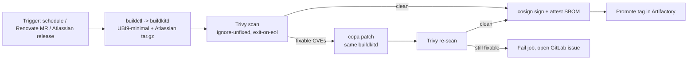

# Caracara: continuously patched Atlassian container images

Jira, Confluence and Bitbucket Data Center images that are **rebuilt on a
schedule**, sit on a **supported (non-EOL) OS**, and ship with **zero OS-level
CVEs that have a vendor fix**. Three properties, each with a concrete test:

| Property | Concrete test | Enforced by |
|---|---|---|
| Continuously updated | Image rebuilt at least weekly and on any base-image or Atlassian release; image age never exceeds 7 days | Scheduled CI pipeline (`.gitlab-ci.yml` / `Jenkinsfile`), Renovate, Kyverno freshness rule |
| No EOL OS | Base OS has published vendor support past today; Trivy does not report the OS as end-of-life | `trivy --exit-on-eol` in `scripts/gate.sh`, `support-windows.yaml` + `scripts/eol_check.py` |
| No fixed vulnerabilities | Trivy finds zero HIGH/CRITICAL CVEs with a fix version (`--ignore-unfixed`) after Copacetic patching | Trivy gate in CI, Copa patch step (`scripts/patch.sh`) |

What this does **not** promise: CVEs with no upstream fix yet, and CVEs in
Atlassian's own Java code, cannot be patched by rebuilding the OS layer. They
are tracked and handled separately; see [docs/what-copa-cant-fix.md](docs/what-copa-cant-fix.md).

## Architecture

One pipeline, five stages: rebuild from a digest-pinned UBI 9 minimal base
with `buildctl` against a rootless `buildkitd` in the cluster, scan with
Trivy, patch OS packages with Copacetic, re-scan to prove zero fixable CVEs,
then sign and promote in Artifactory. Copa is the fast path between scheduled
rebuilds; the rebuild is what keeps the base fresh. No Docker daemon anywhere.



| Component | Role | Where in this repo |
|---|---|---|
| UBI 9 minimal (or Iron Bank `ubi9-minimal`) | Base OS | `*/Dockerfile` FROM line |
| BuildKit (rootless `buildkitd` + `buildctl`) | Build engine and Copa backend | `k8s/buildkit/`, `scripts/build.sh` |
| Trivy | Scanner: fix-version awareness, EOL detection, SBOM, VEX | `scripts/gate.sh`, `.trivyignore.yaml` |
| Copacetic | OS package patcher driven by the Trivy report | `scripts/patch.sh` |
| GitLab CI or Jenkins | Kubernetes-executor jobs, every job a pod | `.gitlab-ci.yml`, `Jenkinsfile`, `Jenkinsfile.patch` |
| Renovate (self-hosted CronJob) | Base digest and Atlassian version bumps as merge requests | `renovate.json`, `k8s/renovate/` |
| cosign + crane | Sign, attest, promote | `scripts/sign.sh` |
| JFrog Artifactory | Every pull and push, nothing reaches the internet | [docs/artifactory.md](docs/artifactory.md) |
| Kyverno | Admission: signature, SBOM, vuln attestation younger than 7 days | `k8s/policy/` |

## Repository layout

```
jira/ confluence/ bitbucket/   Dockerfile, entrypoint.py, config/*.j2
  <product>/lts/               hardening_manifest.yaml for the Long Term Support line (the only line built): version + every external resource pinned by URL and sha256, and the Iron Bank repository it tracks
shared/                        entrypoint_helpers.py, shutdown-wait.sh, support/ (thread and heap dumps)
ci-tools/                      the single job image: buildctl, trivy, copa, cosign, crane, jq, python3 (+ its own hardening_manifest.yaml)
scripts/                       build, gate, patch, sign, sync-ironbank (+ ironbank.py), manifest.py, pin-version, pin-resource, pin-base, open-gitlab-mr, gen-buildkit-certs, checks, lint
k8s/buildkit/                  rootless buildkitd StatefulSet, mTLS, registry mirrors -> Artifactory
k8s/binfmt/                    optional QEMU DaemonSet for arm64 on an amd64 builder
k8s/renovate/                  Renovate CronJob + global config
k8s/policy/                    Kyverno admission policy, vm.max_map_count DaemonSet for Bitbucket
k8s/gitlab-runner/ k8s/jenkins/ runner values and agent pod template (mount buildkit-client-certs at /certs)
docs/                          the guide, section by section
tests/                         unit tests (python3 -m unittest discover -s tests -t .)
.trivyignore.yaml              time-boxed exceptions only (expired_at mandatory, checked in CI)
support-windows.yaml           the EOL clock: base OS and product LTS dates
renovate.json                  digest pinning, Atlassian custom datasource, postUpgradeTasks
```

## Quick start

1. **Artifactory**: create the repositories in [docs/artifactory.md](docs/artifactory.md)
   and replace `artifactory.example.com` everywhere (`grep -rl artifactory.example.com`).
2. **buildkitd**: `make certs` (or enable `k8s/buildkit/certificates.yaml` with
   cert-manager), `kubectl apply -k k8s/buildkit`, then apply the client
   Secret into the runner / Jenkins namespaces.
3. **ci-tools image**: build `ci-tools/Dockerfile` once by hand (it is the
   bootstrap image) and push it to `docker-atlassian-local/ci-tools`.
4. **Sync and pin**: `make sync` clones every LTS line's Iron Bank repository
   (`development` branch) and adopts its version and product checksum.
   `make manifest-check` then lists what is still unpinned:
   `scripts/pin-resource.sh bitbucket/lts GIT` (unless Iron Bank supplied it)
   and `scripts/pin-resource.sh ci-tools --all` download and pin git, copa and
   crane. The build refuses to run while any resource in a
   `hardening_manifest.yaml` has no sha256. Then `scripts/pin-base.sh jira`
   (or let Renovate do it on its first run).
5. **CI**: GitLab: set the masked variable `ART_DOCKER_CONFIG` (docker
   `config.json` for Artifactory), create the two pipeline schedules
   (`JOB=rebuild` weekly, `JOB=patch` daily). Jenkins: create the credentials
   named in `Jenkinsfile`, one job per Jenkinsfile.
6. **Renovate**: create the `renovate` Secret, `kubectl apply -k k8s/renovate`.
7. **Admission**: put the Jenkins cosign public key and your GitLab OIDC
   subject in `k8s/policy/kyverno-atlassian-images.yaml` and apply it.
8. `make lint` locally before every merge request.

Full setup and recurring checklists: [docs/policy-and-ops.md](docs/policy-and-ops.md).

## Docs

- [Base image strategy](docs/base-image-strategy.md): why UBI 9 minimal, the minor-version trap, digest pinning.
- [Artifactory](docs/artifactory.md): the repositories and what goes through each.
- [Building with BuildKit](docs/building.md): the hardening manifest (resources pinned by URL and sha256, tini as a pinned binary, git from source), Dockerfile pattern, per-product differences, buildctl invocation, multi-arch.
- [Scanning with Trivy](docs/scanning.md): the two scans, flags, Red Hat fix versions, VEX and the ignore file.
- [Patching with Copacetic](docs/patching.md): the daily fast path and its limits.
- [Pipeline](docs/pipeline.md): triggers, the shared daemon, GitLab CI and Jenkins.
- [What Copa can't fix](docs/what-copa-cant-fix.md): Java layer, product advisories, version support windows, SLAs.
- [Policy gates and ops checklist](docs/policy-and-ops.md): Kyverno, setup and recurring tasks, sources.

## LTS lines, Iron Bank upstreams and tags

Only the **Long Term Support (LTS)** line of each product is built, from
`<product>/lts/`. That is the line Iron Bank hardens, and the one Atlassian
keeps shipping security fixes for over a two-year window. The CI matrix is
`PRODUCT x LINE` with `LINE = lts` (three images per run); a second line can
be added as another directory and matrix value if you ever need one.

**Versions come from Iron Bank.** Each manifest names the Iron Bank git
repository it tracks under `upstream.ironbank`, in the form
`https://repo1.dso.mil/dsop/atlassian/<product>-data-center/<product>-lts.git`
(Iron Bank Containers / Atlassian / *Product* Data Center / `<product>-lts`).
`scripts/sync-ironbank.sh --all` shallow-clones that repository's
**`development` branch** and adopts the product version, the tarball URL and
sha256 Iron Bank verifies, and tini/git pins when Iron Bank carries them. The
weekly rebuild runs the sync first, builds from the synced manifests, and
opens a merge request so git catches up; `make sync` does the same locally.
Runners without egress to repo1.dso.mil set `IRONBANK_GIT_BASE` to a GitLab
pull mirror of the Iron Bank projects. Renovate deliberately does not touch
product versions. Tags in `docker-atlassian-local`:

| Tag | Mutable | Meaning |
|---|---|---|
| `jira:11.3.11-<pipeline>` | no | one rebuild of the pinned version |
| `jira:11.3.11` | yes | latest signed digest for that version (rebuild or daily patch) |
| `jira:lts` | yes | the line tag; deploy from this and let admission enforce freshness |

When Iron Bank moves a project to a new line, the sync follows it; update the
line's entry in `support-windows.yaml` when that happens.
`scripts/pin-version.sh <product>/lts <version>` remains the manual
override (an emergency Atlassian advisory before Iron Bank has caught up).

## Running the images

The entrypoints render configuration from environment variables (Jinja2
templates in `<product>/config/`), fix home-directory permissions when started
as root, strip `*_PASSWORD`/`*_TOKEN` variables from the environment, and exec
the product start script under `tini`. Common variables:

| Variable | Purpose |
|---|---|
| `ATL_PROXY_NAME`, `ATL_PROXY_PORT`, `ATL_TOMCAT_SCHEME`, `ATL_TOMCAT_SECURE`, `ATL_TOMCAT_CONTEXTPATH` | Reverse proxy settings (Jira, Confluence) |
| `ATL_JDBC_URL`, `ATL_JDBC_USER`, `ATL_JDBC_PASSWORD`, `ATL_DB_TYPE` | Database (driver and dialect derived from the type) |
| `JVM_MINIMUM_MEMORY`, `JVM_MAXIMUM_MEMORY`, `JVM_SUPPORT_RECOMMENDED_ARGS` | JVM sizing and flags |
| `CLUSTERED` / `ATL_CLUSTER_TYPE` / `HAZELCAST_NETWORK_KUBERNETES` | Data Center clustering (Jira / Confluence / Bitbucket) |
| `ATL_FORCE_CFG_UPDATE=true` | Re-render config files that are normally written once |
| `SEARCH_ENABLED=false` | Bitbucket: do not start the bundled OpenSearch |

Ports: Jira 8080/40001, Confluence 8090/8091, Bitbucket 7990/7999. Home
volumes: `/var/atlassian/application-data/<product>`.

## License

MIT, see [LICENSE](LICENSE). The Atlassian products themselves are licensed
by Atlassian; this repository only packages them.
