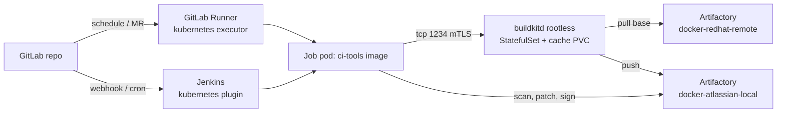

# Pipeline: rebuild weekly, patch daily, everything in Kubernetes

| Trigger | Action | Output |
|---|---|---|
| Renovate MR: base digest or Atlassian version bumped | Full rebuild on the MR, merge, rebuild on main | New `X.Y.Z-<pipeline id>` tag, version tag moved |
| GitLab pipeline schedule / Jenkins `cron('H 2 * * 0')` with `JOB=rebuild` | Full rebuild of every supported line: `PRODUCT x LINE` = jira, confluence, bitbucket x lts, latest | New `X.Y.Z-<pipeline id>` tag; `X.Y.Z` and the line tag moved |
| GitLab pipeline schedule / Jenkins `cron('H 6 * * *')` with `JOB=patch` | Trivy on each live line's version tag; if fixable OS CVEs, `copa patch` and re-gate | Version and line tags moved to the patched digest |
| Trivy `--exit-on-eol` returns 2 | Fail and open a GitLab issue: base OS reached EOL, bump major | Issue |
| Atlassian security advisory feed | Renovate custom datasource bumps `VERSION` (+ `SHA256` via `postUpgradeTasks`) | MR, then rebuild |

## The shared daemon

One `buildkitd` per cluster (or per node pool for arm64) in its own namespace,
rootless, mTLS, with a persistent cache (`k8s/buildkit/`). No job needs
`privileged`, a Docker socket, or a sidecar. Rootless BuildKit needs an
unconfined seccomp profile and, on AppArmor nodes, the
`container.apparmor.security.beta.kubernetes.io/buildkitd: unconfined`
annotation; both are in the StatefulSet, per BuildKit's
[Kubernetes examples](https://github.com/moby/buildkit/tree/master/examples/kubernetes).
`buildkitd.toml` (ConfigMap) mirrors `docker.io`, `ghcr.io`,
`registry.access.redhat.com` and `registry1.dso.mil` into Artifactory.

Certificates: `scripts/gen-buildkit-certs.sh` (bootstrap) or
`k8s/buildkit/certificates.yaml` (cert-manager, rotating). Server certs go in
the `buildkitd-server-certs` Secret in `buildkit`; client certs in a
`buildkit-client-certs` Secret mounted into job pods (GitLab:
`[[runners.kubernetes.volumes.secret]]` in `k8s/gitlab-runner/values.yaml`;
Jenkins: the `volumes:` entry in the pod template). Both CI systems get the
same variables: `BUILDKIT_HOST`, `BUILDKIT_CERTS`, and Artifactory docker
credentials.

## GitLab CI

`.gitlab-ci.yml`, stages `lint, build, gate, sign, patch`. Two schedules set
`JOB=rebuild` (weekly) and `JOB=patch` (daily). The matrix is `PRODUCT x LINE`
and each job works on `TARGET=$PRODUCT/$LINE` (the directory holding that
line's `hardening_manifest.yaml`). The `build` job writes
`out/<product>-<line>/build.env` (`TARGET`, `PRODUCT`, `LINE`, `TAG`,
`VERSION`, `DIGEST`) as a plain artifact; `gate` and `sign` source it. Signing
is keyless with the GitLab OIDC token (`id_tokens: SIGSTORE_ID_TOKEN`) and
`EXTRA_TAGS=$LINE` makes `sign.sh` move the `lts`/`latest` tag along with the
version tag.

## Jenkins

`Jenkinsfile` (weekly rebuild + gate + sign) and `Jenkinsfile.patch` (daily
Copa) as two jobs so their crons and matrices are independent. Jenkins has no
OIDC identity for Sigstore out of the box, so signing uses a key held in
Jenkins credentials (`cosign-private-key`) or a KMS URI in `COSIGN_KEY`; the
Kyverno policy accepts either the GitLab keyless identity or that key.

## Three details that make this continuous rather than ceremonial

1. The daily job scans the **live tag**, not a cached report, so a CVE
   published overnight is caught.
2. `crane tag` moves the mutable version tag to the patched digest inside
   Artifactory, so deployments with `imagePullPolicy: Always` or Argo CD Image
   Updater pick it up without a manifest change.
3. cosign policy at admission (Kyverno `verifyImages`) rejects anything that
   skipped the gate, including someone pushing an old digest back.

## Tag scheme

| Tag | Mutable | Meaning |
|---|---|---|
| `jira:11.3.11-<pipeline>` | no | one rebuild |
| `jira:11.3.11` | yes | latest signed digest for this version (rebuild or patch) |
| `jira:lts`, `jira:latest` | yes | the line tags (`<product>/lts`, `<product>/latest`); what deployments reference |
| `jira:11.3.11-patched`, `jira:11.3.11-patched-<date>` | working / history | Copa outputs; cleaned by retention |
| `cache/jira` | n/a | BuildKit registry cache (shared by both lines) |
